# Editor and Coding Basics

### Overview

After you've built your schema and entered your content, the last step is to navigate to the Editor section and code it in. The process of coding involves Zesty.io's proprietary templating language [Parsley](https://zesty.org/services/web-engine/introduction-to-parsley), [HTML](https://developer.mozilla.org/en-US/docs/Web/HTML), [style sheet](https://en.wikipedia.org/wiki/Style\_sheet\_\(web\_development\)) language(s), and [JavaScript](https://developer.mozilla.org/en-US/docs/Web/JavaScript). Parsley is used to dynamically populated pieces of content by defining a scope, and then selecting a field from that scope; HTML provides the structure, and JavaScript allows for a more dynamic experience.&#x20;

Below we'll give you a brief guide of the Editor section, including a brief Parsley overview. If you're not comfortable with HTML and Javascript there are plenty of educational resources online for users at every level.&#x20;

### A Quick Guide to the Editor Section

A link to the Editor section can be found in the header navigation. The header navigation is found at the top of the content manager.

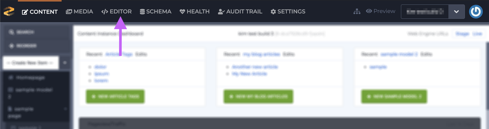

Once the Editor section opens, select a file from one of the left-hand navigation's 3 sections: Views, Style Sheets, and Scripts,  and edit the code in the main portion of the screen. The drawer below the main portion of the screen is the utility drawer which contains snippets of Parsley, meta tags, publishing history, and more.

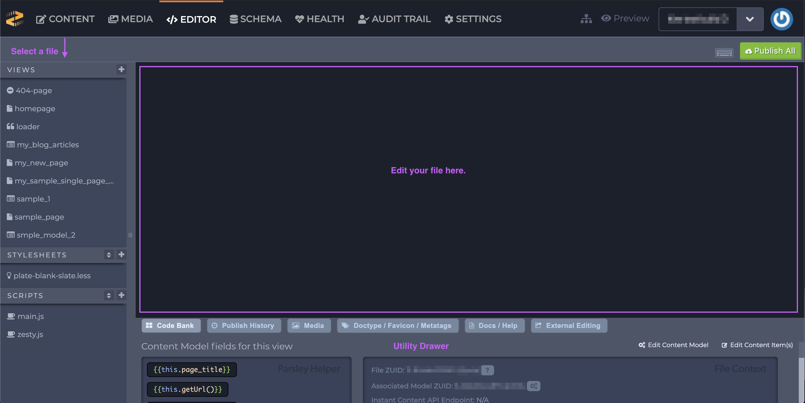

#### Views

The views are organized alphabetically except of the endpoints that begin with a forward slash  `/` which will appear at the top of the list. Select a file by clicking on it and the code will show in the main portion of the screen.

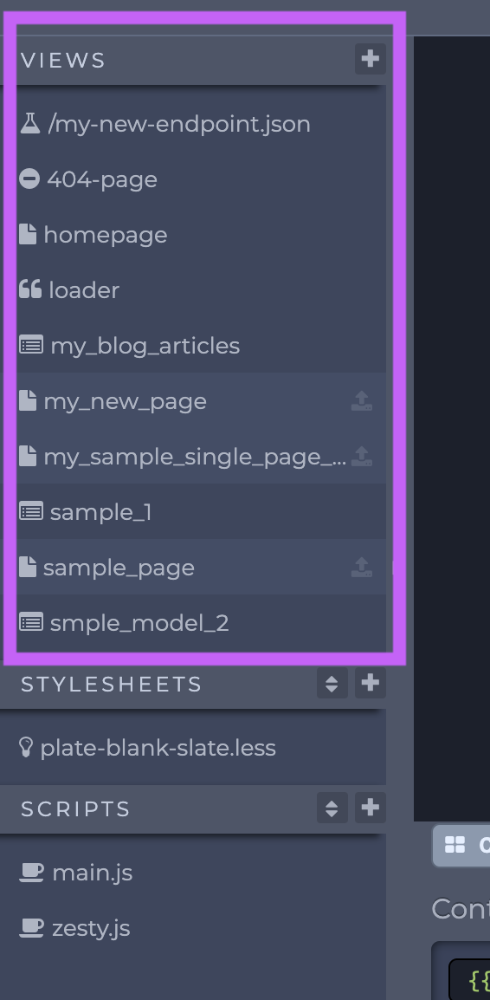

**General tour**

Once a file is selected a tab will show below the header nav with that file's name and the code shows in the main portion of the screen.

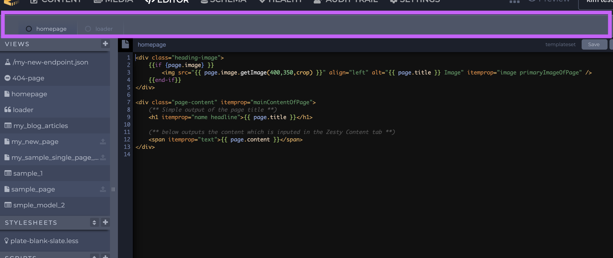

The name of the file that you're in shows at the top of the code editing portion (main portion) of the screen.

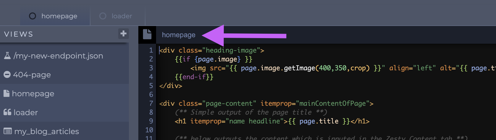

**Adding files**

Add a new snippet, endpoint, or HTML Ajax file by clicking the `+` symbol in the Views header.

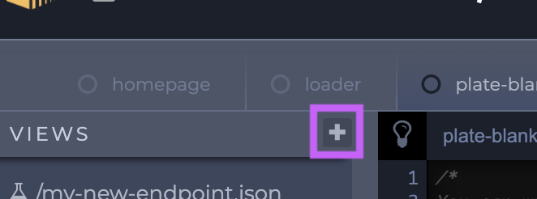

1\. Click the `+` symbol.&#x20;

2\. Select an option: Snippet, HTML Ajax, or Endpoint.&#x20;

3\. A modal will open so you can name your new file.

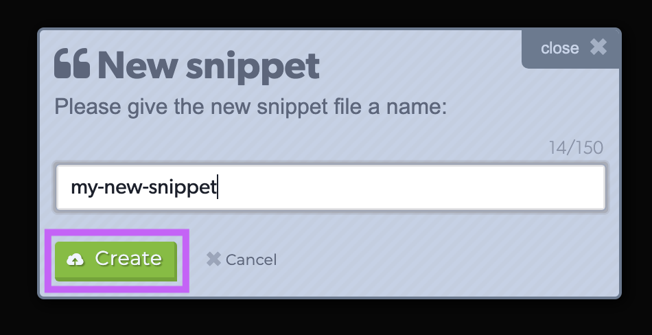

If you choose an Endpoint make sure to start the name with a forward slash and include a file extension such as `.txt` or `.json`.

4\. Click the green Create button to create you new view.

**Editing files**

Click in the code editing portion of the screen to edit the code.&#x20;

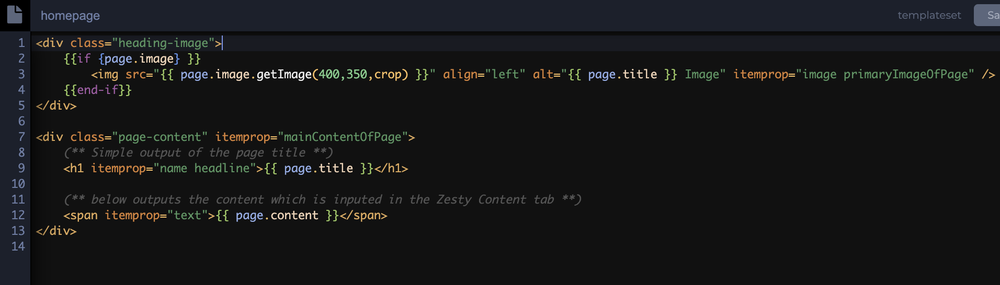

**Saving changes**

Use CMD+s or CTRL+s to save your changes; additionally there is a save button that turns green once changes are made to a file.

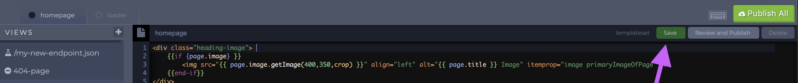

**Publish file(s)**

Once a file has been changed there are several publishing workflows to consider:&#x20;

* Once a file has been edited and saved. An icon will show next to its name in the left-hand navigation. Click the icon to publish it.&#x20;

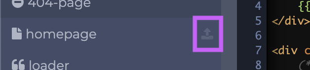

* Click the Review and Publish button which is next to the green Save button.&#x20;

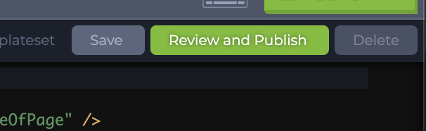

Once you have reviewed your changes click the green Publish to Live Web Engine button to publish your changes.

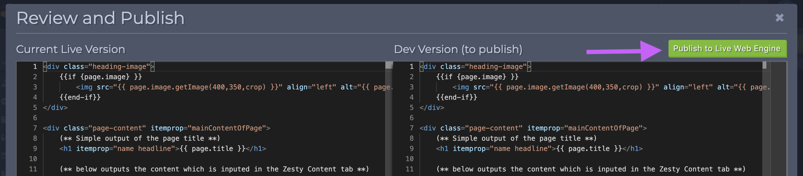

* Click the green Publish All button which is shown above the Review and Publish button.&#x20;


Use the Publish All button with caution. This button will publish _all_ of your changes. For example, if multiple changes have been made and saved across a number of files like style sheets, script, and views clicking Publish All will send all of those files live.&#x20;


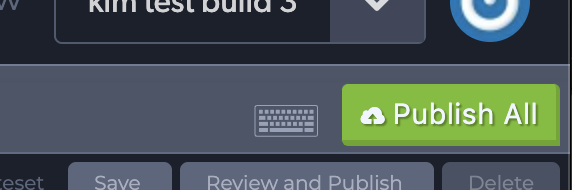


Stylesheets and Scripts have the same editing, saving & publishing, and new file workflows as the Views thus the Style Sheet and Scripts descriptions will not contain images for viewing/editing/publishing/adding those files.


#### Stylesheets

The Stylesheets section is below the Views section in the left-hand sidebar and supports CSS, SCSS, and LESS files.&#x20;

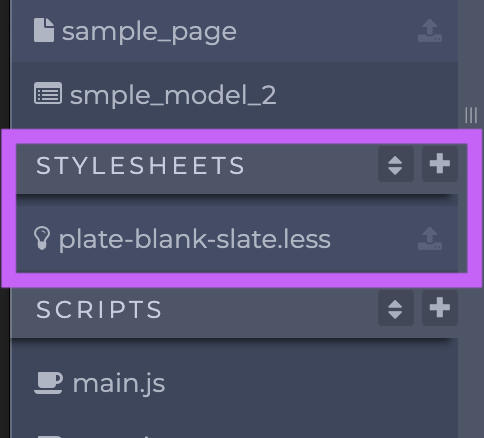

**Reordering style files**

1\. Click the stacked up and down arrows to rearrange the order of your files.&#x20;

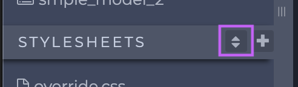

2\. Use the arrows to drag filed and rearrange them.

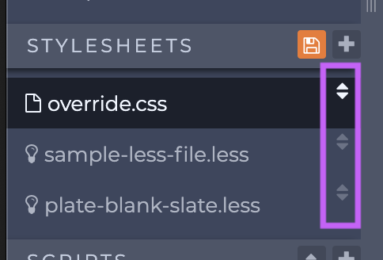

3\. Click the orange button with disc icon to save the order of your files.

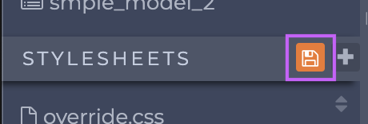


Script files are reordered in the same way as stylesheet files thus the Scripts section below does not contain images and instructions on how reorder files.


#### Scripts

The Scripts section is located below the Stylesheets section in the left-hand sidebar and supports JavaScript files.

In addition to manually coding and copying and pasting in code users can also use a JavaScript link to a CDN to add scripts. When adding a new script, select the JavaScript Link option to add a link to a CDN.&#x20;

### Parsley

The following list details all of Parsley's basic rules. Learn more about Parsley&#x20;

**Basic Rules**

* Curly brackets (single or double):
  * on the same line will be parsed
  * on separate lines will **not** be parsed
  * in fields will **not** be parsed
* Spacing
  * Single curly brackets: no spaces between Parsley call and bracket (e.g. `{this.my_field}`)
  * Double curly brackets: space(s) allowed between call and bracket (e.g. `{{ this.my_field }}`)

#### Syntax Structure

**Whitespace**

White space does not matter within double quotes but can't be used within single quotes.

**Comparisons**

Use double equals `==` in `if` statements and single equals everywhere else.

**Quotes**

Do not use quotes in `if` statements. Only use quotes around hard coded strings and single bracket parsley variables everywhere else.

**Conjunctions**

Use `&&` and `||` in `if` statements, and `and` and `or` everywhere else.

**Brackets**

Use double curly brackets `{{ }}` to start a Parsley statement. Use single curly brackets `{ }` when making a Parsley call within a double-bracketed call.&#x20;

**Comments**

Use `(**` to start and `**)` to end comments that will not render in the output of the website.


Parsley _only_ works in Views. It does not work in Style Sheets or Scripts.


**Defining Scope**

When we're referencing a field on a page we need to use Parsley to call that field within its proper scope using `{{ this. }}`.  `this` provides the scope and once the user types a `.` or period, Zesty.io will populate a list of available fields and calls for that content model. HTML can be wrapped around Parsley calls too; for example`<h1>{{ this.page_title }}</h1>`

When accessing items in a multi-page set or headless set it is often necessary to use a [Parsley each loop](https://zesty.org/services/web-engine/introduction-to-parsley/each-loop-deep-dive). Each loops allow users to iterate through a multi-page and headless content model's items. When using an each loop you need to know the name of the content model that you want to loop through. A content model's name is defined by its Reference Name which was assigned when the multi-page and headless content model was created. In the each loop below the content model's Reference Name is underlined in purple.

### Conclusion

These basics should help you get started coding your website. For more information on Parsley reference the [Parsley section](https://zesty.org/services/web-engine/introduction-to-parsley) of our documentation.
