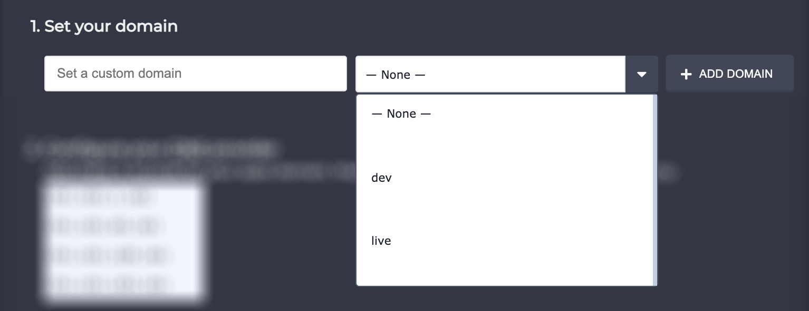
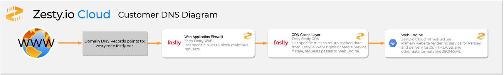
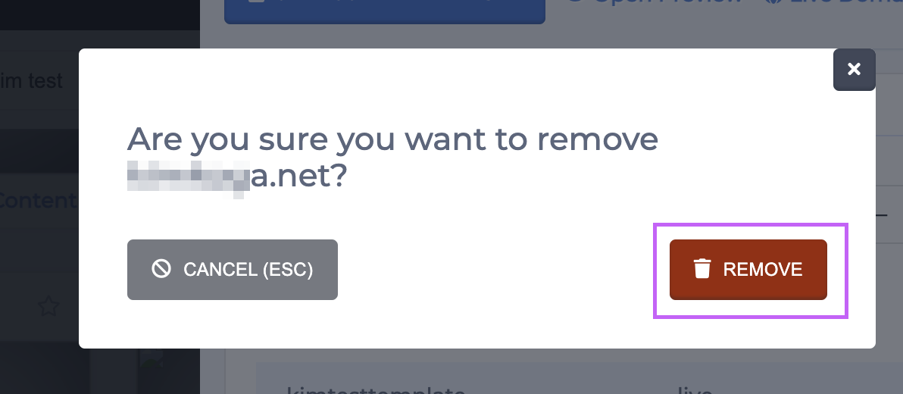

# How to Launch an Instance

**This guide is for launching instances with custom domains. Please disregard this if you're using the default `zesty.dev` domains.**

There are 3 steps to making your instance accessible to the public.

1. Set a custom domain name
2. Configure your DNS
3. Confirm your instance is live


Before beginning the process to send your instance live ensure that all content and code that you want to be made available to the public are published and listed accordingly.



New Site Launch Checklist



Site Migration Checklist


## 1. Set a Custom Domain Name

Start by locating the instance that you want to launch in the Accounts Manager interface and then click that instance's "Publish Instance" button.

After you click the "Publish Instance" button the instance settings will open and prompt you to set a domain name and configure your DNS settings.&#x20;

Enter your custom domain name in the textbox, select a branch, and click **+ Add Domain**. The domain name should be limited to the root only. Do not add protocol or trailing slash. For example, if your domain is example.com you'll enter `example.com`.&#x20;

## 2. Configure you DNS


**Hybrid OYD:** If you are setting up a domain with Hybrid Zesty.io, please follow this guide


Configure your domain's DNS settings by following the instructions in the settings drawer.&#x20;


**Please note**: Domain registrars are not one-size-fits-all so each step may not be applicable. See the [**Common DNS Registrars**](https://zesty.org/guides/how-to-launch-an-instance#common-dns-registrars) section below for more information.



**Cloudflare Users**: When setting DNS records in Cloudflare be sure to have the proxied by Cloudflare, an orange cloud icon, turned off on each record. Zesty.io cannot affectively manage the cache if Cloudflare is proxing requests and caching them.


There are 2 primary records you will want to ensure are setup.

1. The apex record (_e.g. example.org_)
2. The WWW sub-domain record (_e.g. www.example.org_)

When creating these records there will be 3 values that are required to set them up.

1. Record type
2. Host (or name)
3. Value.

### Apex Record

[What is an apex record?](https://docs.microsoft.com/en-us/azure/dns/dns-zones-records#record-types)

[Why can't I use a CNAME for my apex record?](https://www.isc.org/blogs/cname-at-the-apex-of-a-zone/)

Create or set an existing apex record with the following values:

* _Record type_: `A`
* _Host_: `@`
* _Value_ (**Create a separate A record for each of these IP addresses**):
  * `151.101.1.161`
  * `151.101.65.161`
  * `151.101.129.161`
  * `151.101.193.161`


The `@` symbol is a special value in DNS that means, the current domain.


### WWW Record

Create or set an existing WWW record with the following values:

* _Record type_: `CNAME`
* _Host_: `WWW`
* _Value_: `zesty.map.fastly.net`

## 3. Confirm your instance is live

To confirm that your instance is live click the green "? Check DNS" button. You should see a notification in the bottom left-hand corner of the screen letting you know if your DNS has been verified.


DNS changes can take time to propogate and for your ISP to pickup. They can also be cached. If you don't see your changes taking effect try loading the domain in a new browser and/or gibing it more time. Typically an hour or two is enough.


## Additional Configurations

### HTTPS & WWW


If necessary you can configure your HTTPS and WWW settings before launching your site.


Open the Content Manager interface and navigate to the Settings section. Under General you'll find your HTTPS and WWW site settings.&#x20;

.png>)

Above you can see these settings outlined in orange. The tooltips will help you navigate this area and give you information about each setting.

If you want to always redirect to HTTPS then the "HTTPS on?" setting must be turned on. To turn this setting on click the "HTTPS on?" button and it will turn green.

If you'd like to force prepending your domain with WWW then click the "Always prepend WWW to my domain?" button.

Ensure you save settings before continuing on.

## **Common DNS Registrars**

Since there are many places to purchase domains it's difficult to create all-inclusive instructions to setting up a DNS record. Below you'll find some common DNS registrars and their setup instructions.



* [Setting a CNAME record for www](https://www.namecheap.com/support/knowledgebase/article.aspx/9646/10/how-can-i-set-up-a-cname-record-for-my-domain)
* [Redirecting example.org to www.example.org](https://www.namecheap.com/support/knowledgebase/article.aspx/385/77/how-do-i-set-up-a-url-redirect-for-a-domain)



* [GoDaddy Managing DNS](https://support.godaddy.com/help/article/680/managing-dns-for-your-domain-names)



* [Manage DNS settings](https://www.domain.com/help/article/dns-management-how-to-update-dns-records)
* [Updating CNAME records](https://www.domain.com/help/article/dns-management-how-to-update-cname-aliases)



* [DNS management](https://my.bluehost.com/hosting/help/559)
* [Creating and understanding CNAMEs](https://my.bluehost.com/hosting/help/cname)



* [DNS management](https://www.hostgator.com/help/article/manage-dns-zones)



## Swapping out domains

Two instances cannot have the same domain assigned to it. Before the domain is added to a new instance it will need to be removed from the old one.&#x20;

### Removing a domain name

1. From the Accounts settings drawer, click the red trashcan icon button to the right of the name.&#x20;

2\. A modal will pop up and confirm that you'd like to remove the domain. To confirm click the red **Remove** button.&#x20;

If it's been successfully removed a success notification will appear in the lower left-hand corner of the screen and you'll be able to add that domain to another instance.
