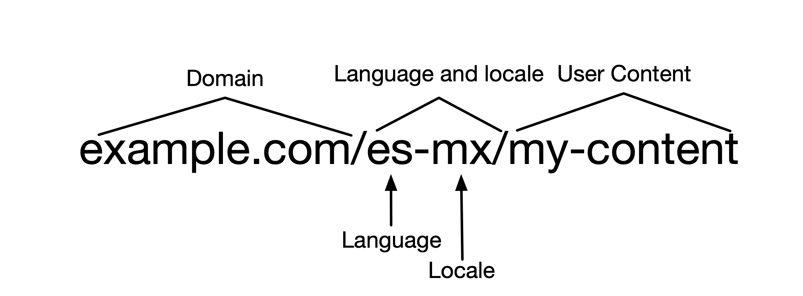
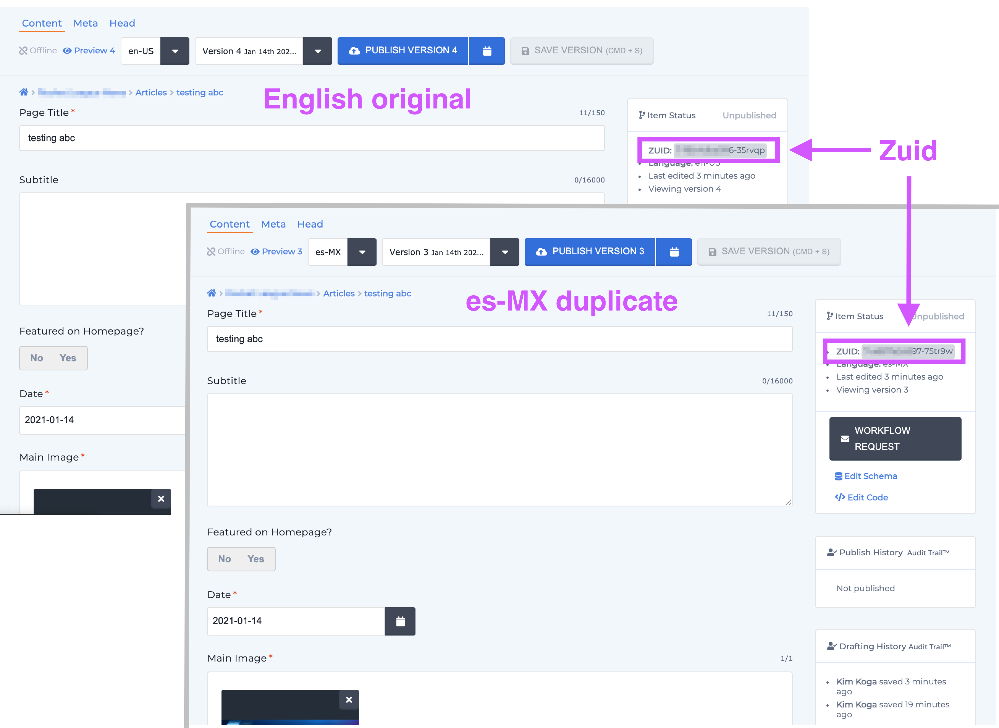
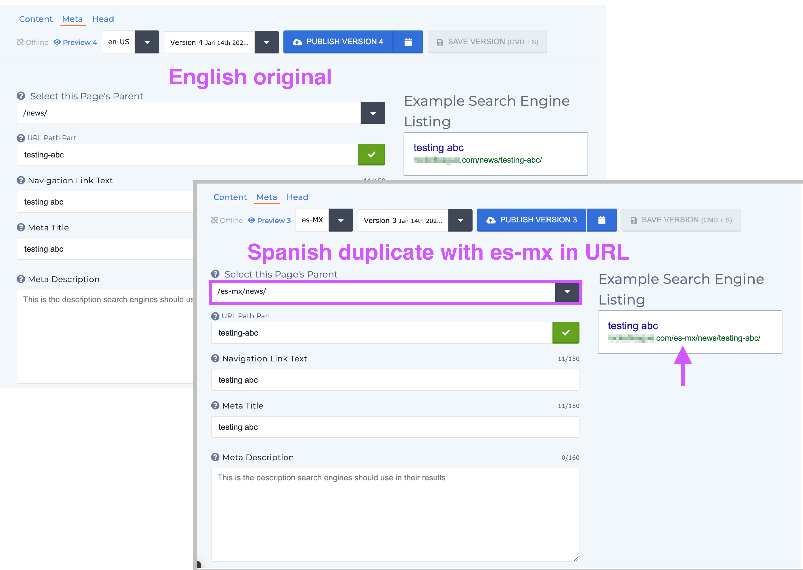
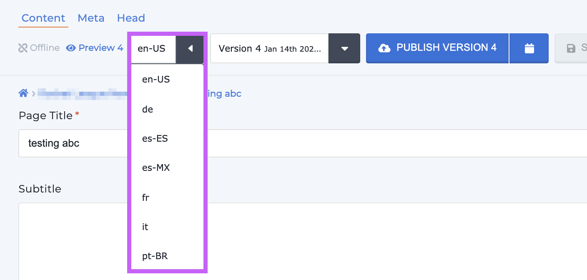
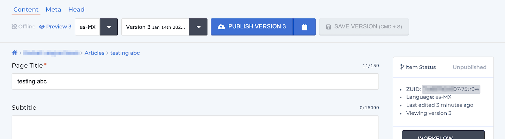

# How to Set Up Internationalization (i18n)

### Overview

Internationalization (i18n) refers to adapting your instance's into another language. This gives sites with an international audience the ability to create content in different languages with the click of a button. _**Note: By default all Zesty.io instances are in English. Contact support@zesty.io if want to make an instance with a different default language. **_ When languages are added the muti-lang URLs will contain both the language _and_ locale as applicable. For example, es (Spanish) has variants by locale such as CO (Columbia), ES (Spain), MX (Mexico), UY (Uruguay) and so on; the URL will be in the form of domain/language-locale/my-content e.g., `example.com/es-mx/my-content`.


Zesty.io's multi-lang will **not** translate the page for you. However, it will add the language and locale to the URL.


Once a language is added the template is duplicated. Although languages share a template _they have separate ZUIDs_ - in other words - duplicates do not share their ZUID with the original language. For example, the template for English will have the same template as Spanish, however, each one will have their own ZUID.&#x20;

&#x20;And the item's path will be prepended with the language and locale _except for the original language_.


Deleting one multi-lang item will delete all of its siblings. \
For example, if you have an item in en-US, es-MX, and fr-FR and you delete the es-MX item, its en-US and fr-FR siblings will also be deleted.


### Before you begin&#x20;

Adding languages to your instance requires using our [API](https://zesty.org/getting-started/i18n-multi-language) to both add _and_ activate languages. If you're not familiar with using APIs there are many resources online to support your learning, such as [Mozilla Developer Network](https://developer.mozilla.org/en-US/docs/Learn/JavaScript/Client-side\_web\_APIs/Introduction).

### **Steps for implementing i18n**

#### **Step 1: Adding languages**

Follow our API documentation to [add a language](https://zesty.org/getting-started/i18n-multi-language#adding-a-language).


Multiple languages **cannot** be added with a single **POST**. Every language that you add requires a separate POST. For example, if you wanted to add es-MX, es-ES, and es-UY - you'll need to do three (3) separate **POST**s to add each language.


#### **Step 2: Activating languages**

Follow our API documentation to [activate a language](https://zesty.org/getting-started/i18n-multi-language#activating-a-language). **Languages must be activated in order to be viewed on a live site.**


Multiple languages **cannot** be activated with a single PUT. Every language that you want to activate requires a separate PUT.


### **Creating Content in Other Languages**

Once internationalization is setup, a language selector dropdown will appear in each content item that allows you to select the language.

Select the language/locale option from the dropdown. Once selected, you will be able to edit content for that item in the chosen language/locale. Each language/locale will have its own versions and ZUID.

