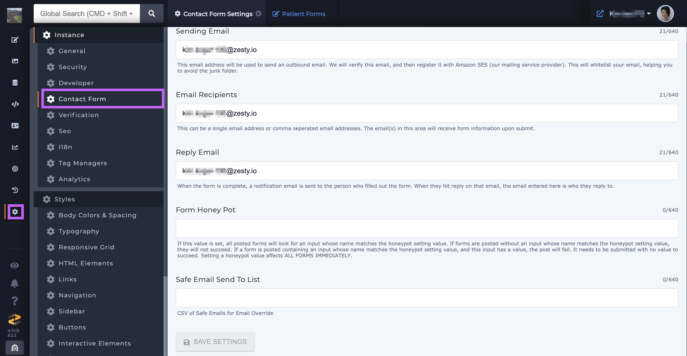
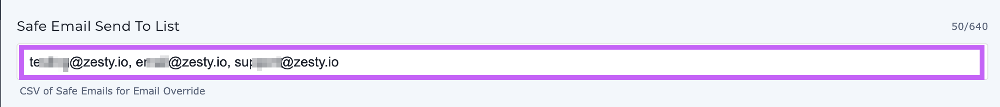
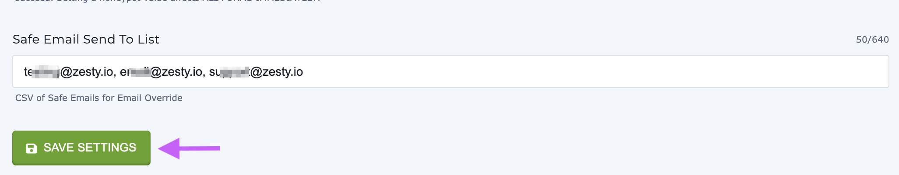

# How to Use the Safe Email Send To Setting

### Overview

In order to safeguard against email spoofing we've added a setting for forms that are using are an [email override](https://zesty.org/guides/how-to-create-a-lead-form#email-override-setting-a-specific-form-to-notify-a-different-email-than-the-one-in-settings) field. This field is activated by adding a list of emails in the form of comma separated values (CSV). When the field is activated the email override value will be validated against the CSV list; if the email override value does _not_ match a value in the list the email will not be sent.

### Behavior

There are 3 different behaviors that can happen on form submission depending on whether or not the Safe Email field is filled out.&#x20;

1. **The field is left blank:** on submission the field is ignored.
2. **The field is filled out **_**and matches**_** the email override value:** on submission Zesty.io will validate the email override value against the Safe Email field value(s) and will send an email.
3. **The field is filled out and it **_**does not match**_** the email override value:** on submission Zesty.io will validate the email override value against the Safe Email field value(s) and will not send an email.

### Adding the Safe Email Send To Setting

This setting can be added via our [API](https://instances-api.zesty.org/#d295e8c8-40a2-435c-85cd-23a043a7135f) with the following JSON body:

```
{
    "category": "contact-form",
    "keyFriendly": "Safe Email Send To List",
    "key": "safe_emails",
    "value": "",
    "admin": false,
    "parselyAccess": false,
    "dataType": "text",
    "options": "",
    "tips": "CSV of Safe Emails for Email Override"
}
```

If you're not comfortable using our API send a request via [Slack](http://chat.zesty.io/) or email support@zesty.io and ask for the setting to be added to your instance.

### Using Safe Email Send To

Before trying to use this feature be sure that it is available on your instance. If it is not follow the above instructions on how to add it.

1\. Navigate to Settings and then Contact Form.&#x20;



2\. Fill out the Safe Email Sent To List field with comma separated value(s).



3\. Save your changes.



4\. Refresh the cache by publishing a file or use the [refresh cache button](https://zesty.org/guides/refreshing-the-cache) to ensure that the changes you've made have persisted.
