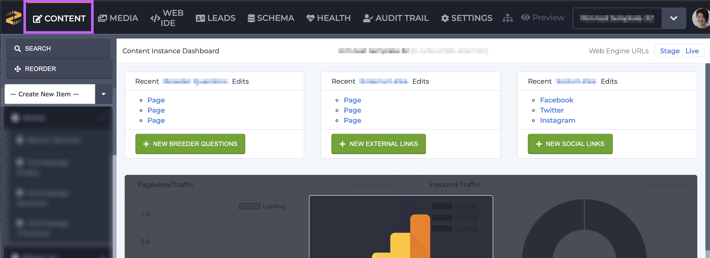
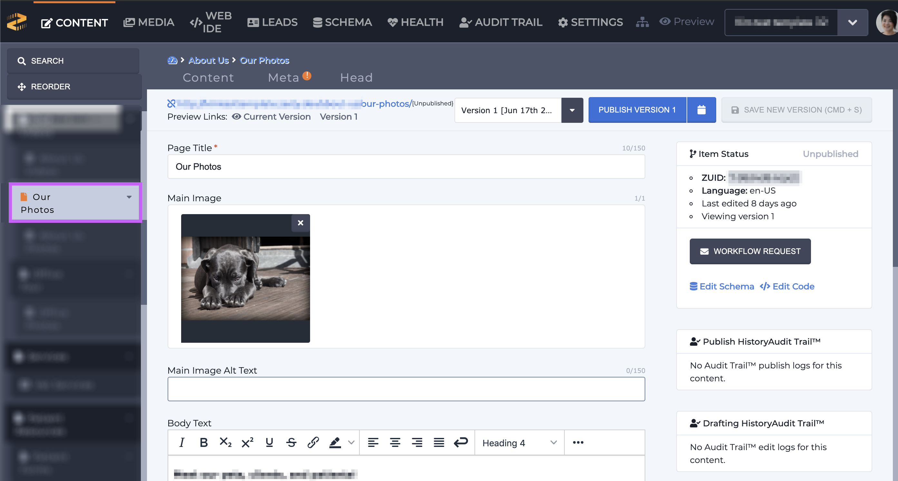
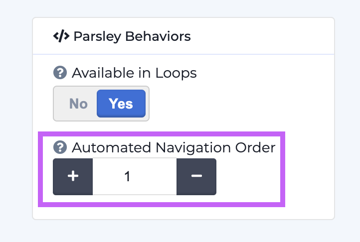
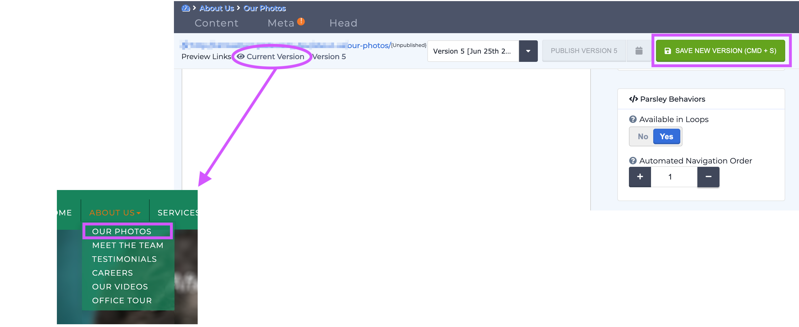

# Reordering Child Items in a Parsley Auto-generated Navigation Bar

### Overview

Parsley's  [`{{ navigation() }}`](https://zesty.org/services/web-engine/introduction-to-parsley/parsley-index#navigation-number) call automatically creates a navigation bar based on an instances content models. Depending on how the call is configured, users will see child items in their navigation bar. Child items will show up in dropdowns underneath their parent item.&#x20;

**Note:** the `{{ navigation() }}` call creates an HTML list structure but does not styles the navigation bar as shown below.

These child items are shown in the order they're created, however users may want to reorder them. Follow the steps below to reorder them.

### Steps to reorder navigation child items

Using the image above as our example we're going to step through how to reorder child  items.

1\. Decide on the order that you want the child items in.

2\. In the Content Manager, navigate to the Content section.

3\.  Locate the item that you've selected to be your first child item and select it.

4\. Scroll down to find the Parsley Behaviors section in the right-hand sidebar.&#x20;

5\. Use the number picker to reorder your item.&#x20;

6\. Click  the green Save button and preview your changes before sending them live.

7\. If you're satisfied with the order click the blue Publish to send your changes live.

8\. Repeat steps 3-7 for each item that you'd like to reorder.
