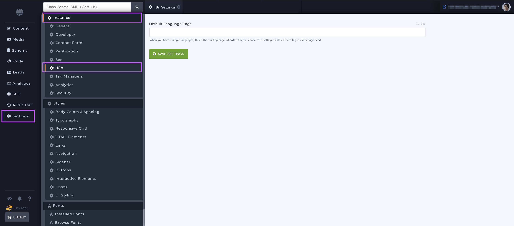
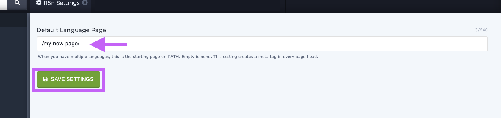

# Setting up the x-default hreflang header

### Overview

The Settings section's i18n setting will help users manage internationalization and allow users to switch between different languages with the click of of the mouse. The purpose of this setting is to designate a specific path for the site to start on such as a page with a map that will allow users to choose their localized language.

The purpose of this head tag is to designate the path that you want _all_ users to be directed to no matter what their language is. For example, this is the page that your French-speaking users and American-English speaking users will see. Learn more about this with this [article from Google](https://developers.google.com/search/blog/2013/04/x-default-hreflang-for-international-pages). The page that is commonly designated has a map or links that allows users to select their locale. here. Hence, it's important to have languages setup and activated _before_ designating your the `x-default hreflang` path.

### Before you begin&#x20;

Before you setup this path you should have a language added to your instance and have it activated. Languages can be added and activated via [API](https://zesty.org/getting-started/i18n-multi-language).

### Setting the x-default hreflang header

1\. Identify which path you'd like to use as you default page

2\. Navigate to the Settings section, and under Instance settings select i18n

3\. Add the path you chose in step 1 and click save.

