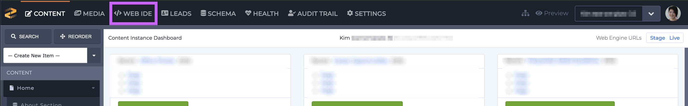
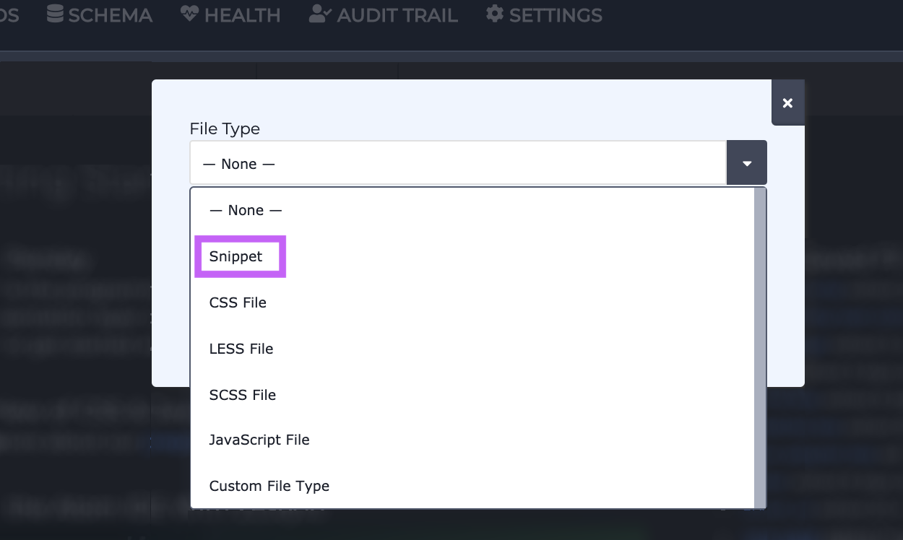
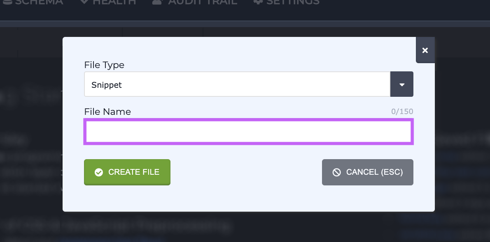
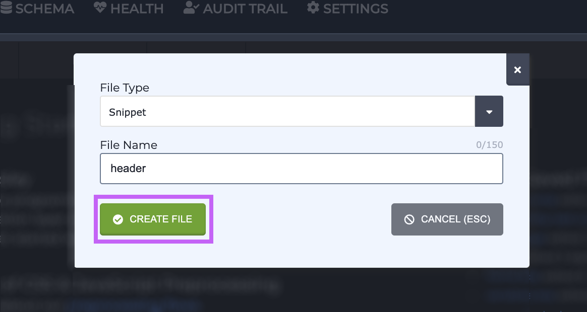
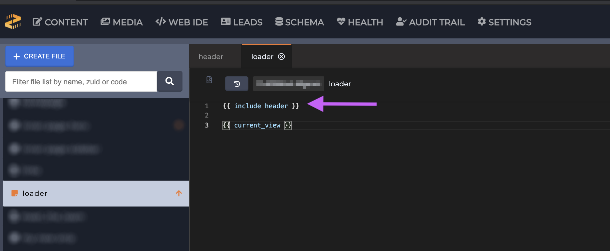
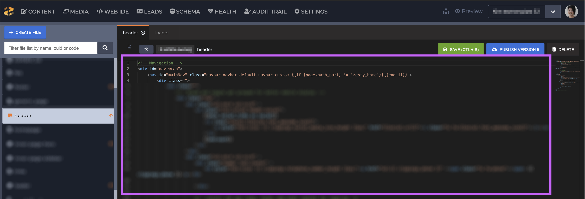
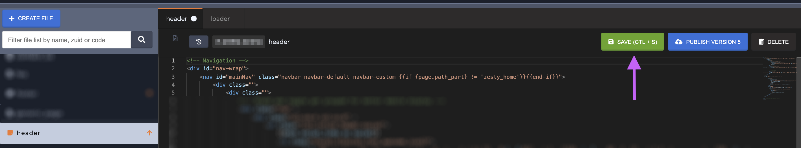
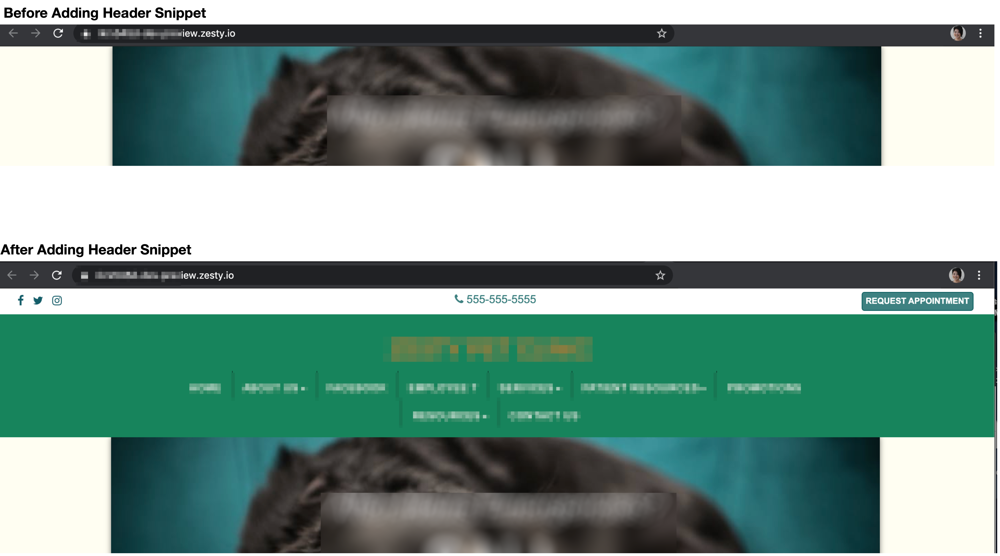
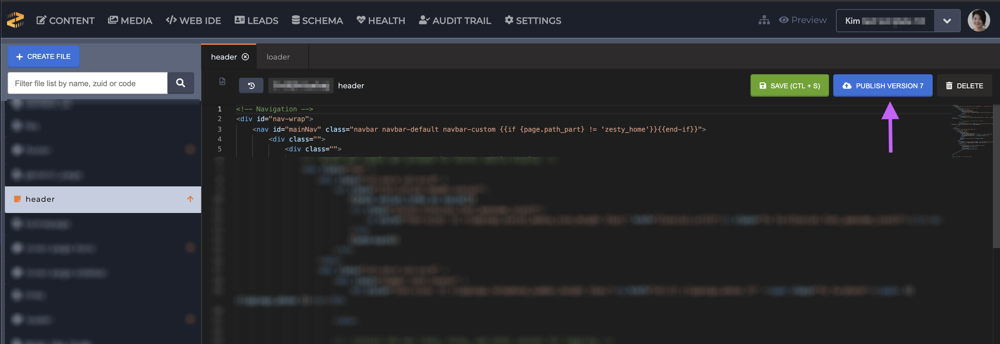

# Using Snippets

### &#x20;Overview&#x20;

The code in Views can get pretty crowded with code depending on what you're working on. [Snippets](https://zesty.org/glossary#snippet) can make all that code more modular and easy to manage by allowing user to abstract complicated and repeated pieces of code into a separate file. When you want to include your abstracted code into a view, use the Parsley [`{{ include }}`](https://zesty.org/services/web-engine/introduction-to-parsley/include) call.&#x20;

### Common Use Cases&#x20;

There are several common use cases that Snippets are commonly used for:&#x20;

* Headers&#x20;
* Footers&#x20;
* Sidebars&#x20;
* Navigation bar(s)&#x20;

While these are common use cases, more complex pieces of code can be abstracted as well. For example, it may be easier to work on a large form when it's abstracted into its own Snippet, or a complex in-View script may be easier to work when it's not surrounded by a View's HTML.&#x20;


The Loader, which comes with every single Zesty.io instance, is a Snippet. This file allows for views to be rendered using the [`{{ current_view }}`](https://zesty.org/services/web-engine/introduction-to-parsley/parsley-index#current\_view) call.&#x20;


### Creating Snippets&#x20;

For this guide we're going to be making a simple header for our website. We are starting at the last step of the [Schema-Content-Code](https://zesty.org/guides/the-connection-between-schema-content-and-code) process: coding it all in. If you need a refresher on how Zesty.io works refer to these articles: [create an instance](https://zesty.org/guides/how-to-create-a-new-instance), [build the Schema](https://zesty.org/guides/building-the-schema-and-selecting-fields), and [add Content](https://zesty.org/services/manager-ui/content/adding-and-managing-content) before jumping into the Web IDE to code it all in.&#x20;

1\. Navigate to the Web IDE.

2\. Create the blue Create File button. Note: depending on your screen size you'll simple see a blue button with a + sign on it.

3\. Select Snippet from the dropdown.

4\. Give it a name. There is no need to add an extension to the file name.&#x20;

5\. Click Create.

### Using Snippets

When working on your Snippet you'll need to include it in a view in order to preview your changes. Since we're working on a header that we want to be on every single page, we're going to add our Snippet to the [Loader](https://zesty.org/services/manager-ui/editor/outputting-content#loader) which loads every view.

After creating your Snippet:&#x20;

1\. Include your snippet in a View so you can view your changes as you're coding.

2\. Code your Snippet as necessary.

3\. Save your changes.&#x20;

4\. preview them before sending them live.

5\. Once you're satisfied with the code in your Snippet, send it live by publishing it.


To send snippets live both the snippet _and_ the view that the snippet is included in need to be published.

