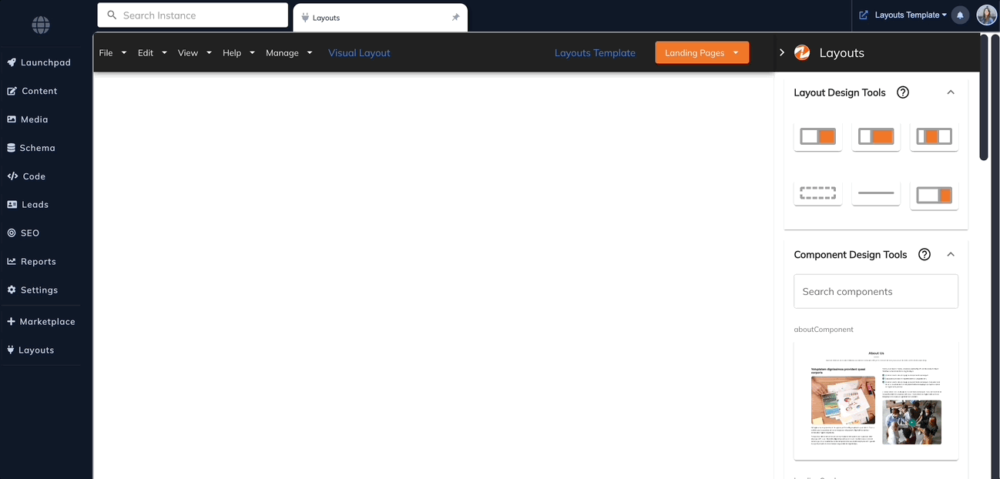
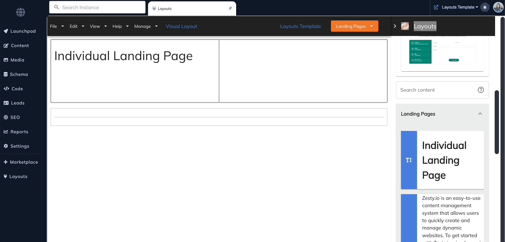
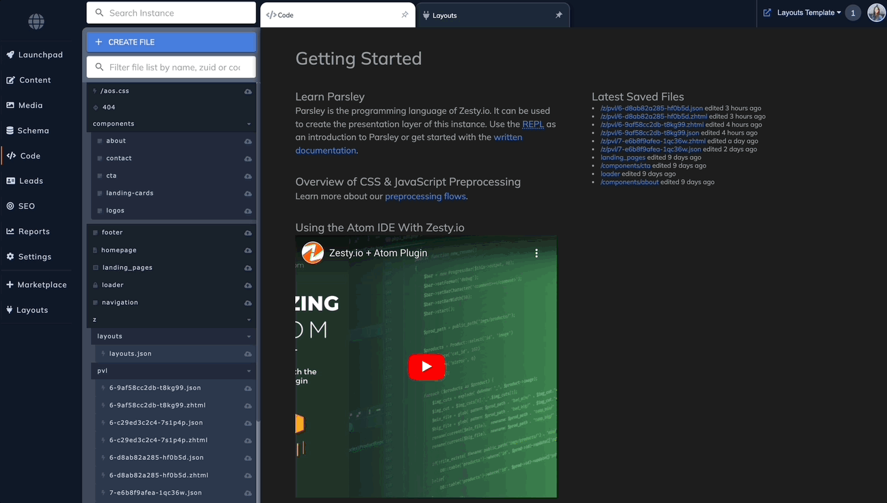
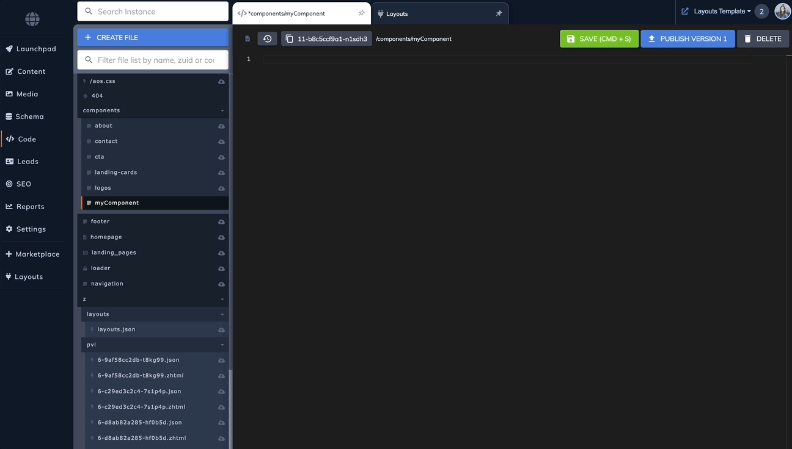
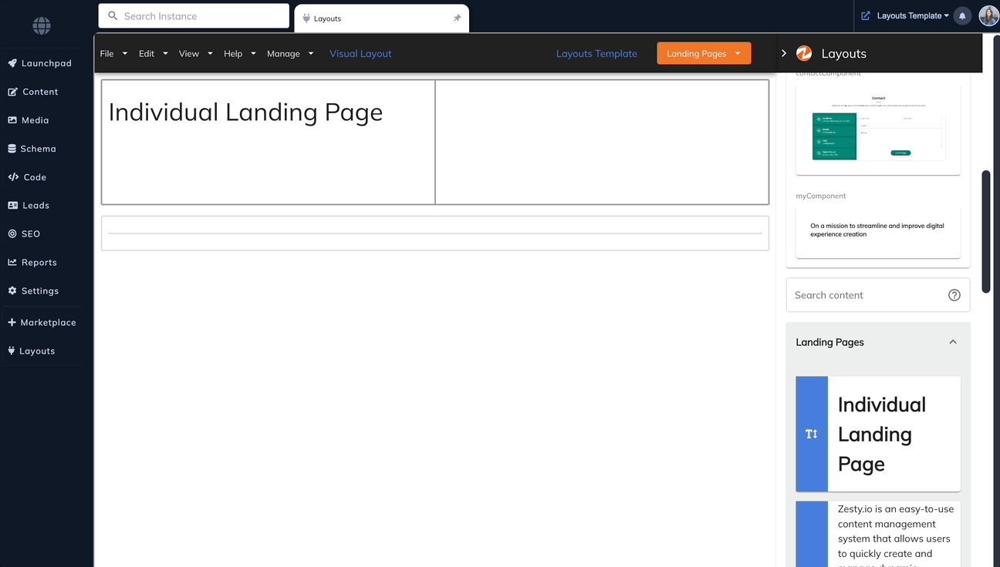

# Layouts

First, Install the [Layouts App](https://www.zesty.io/marketplace/apps/page-layout-designer/) to your instance from our marketplace.&#x20;

### Select your content model

A layout is created against a content model which will dictate the default structure of all items within the content model. For example, if you have a multi-page content model called Articles, then you can create a Layout that will reflect the structure for all items created within that model, ie: all articles.&#x20;

### Drag and drop

Open the Layouts app from the left navigation tree. Select the content model you would like to design.

<figure><figcaption></figcaption></figure>

Start building out your design with our existing design elements such as a 2 columns. Then add content by dragging the field element. The Layouts app will automatically display the content model's configured fields.&#x20;

<figure><figcaption></figcaption></figure>

### Create your own components

Create your custom components to expand on the drag and drop options of the Layouts app. Give it a name, class, an image url (used as the thumbnail in the app), and add your code. For added simplicity, you can even call Parsley in the component's code!&#x20;

<figure><figcaption></figcaption></figure>

<figure><figcaption></figcaption></figure>

### Using Parsley for custom components

In the Code app, create a new snippet file.&#x20;

<figure><figcaption></figcaption></figure>

Add your code, you can even call content dynamically using Parsley. Your snippet file can now be used within your custom component by using the `include` Parsley call. For example, a snippet created with the file name: `/components/myComponent` can be called with the following syntax: `{{ include /components/myComponent`

<figure><figcaption></figcaption></figure>

That's it! You will see your custom component available to be dragged and dropped within the Layouts app. If you are using dynamic Parsley calls within its snippet file, you will see that rendered within the app.

<figure><figcaption></figcaption></figure>
